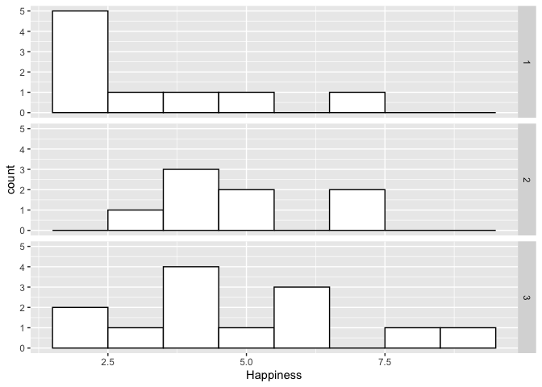
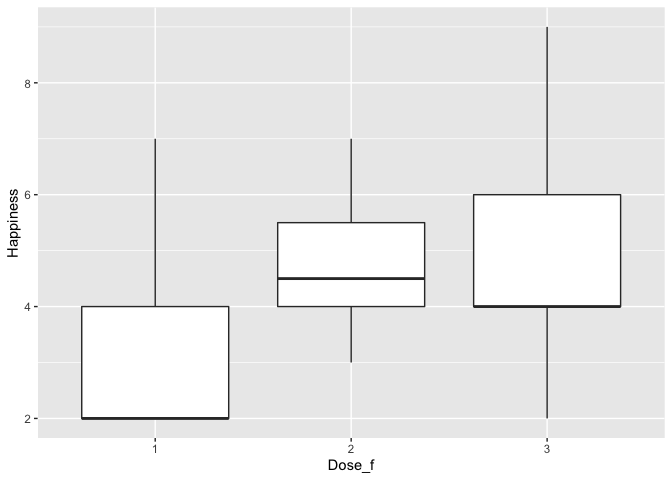
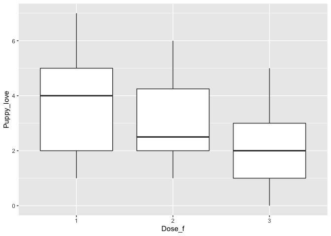
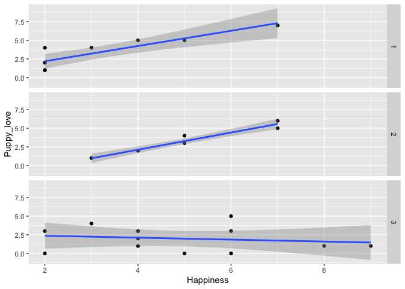

ANCOVA
======

This R markdown document provides an example of performing a regression
using the lm() function in R and compares the output with the
jmv::ancova() function in the jmv (Jamovi) package.

Package management in R
-----------------------

``` r
# keep a list of the packages used in this script
packages <- c("tidyverse","rio","jmv")
```

This next code block has eval=FALSE because you don’t want to run it
when knitting the file. Installing packages when knitting an R notebook
can be problematic.

``` r
# check each of the packages in the list and install them if they're not installed already
for (i in packages){
  if(! i %in% installed.packages()){
    install.packages(i,dependencies = TRUE)
  }
  # show each package that is checked
  print(i)
}
```

``` r
# load each package into memory so it can be used in the script
for (i in packages){
  library(i,character.only=TRUE)
  # show each package that is loaded
  print(i)
}
```

    ## Warning: package 'tidyverse' was built under R version 4.0.2

    ## ── Attaching packages ────────────────────────────────────── tidyverse 1.3.0 ──

    ## ✓ ggplot2 3.3.2     ✓ purrr   0.3.4
    ## ✓ tibble  3.0.1     ✓ dplyr   1.0.0
    ## ✓ tidyr   1.1.0     ✓ stringr 1.4.0
    ## ✓ readr   1.3.1     ✓ forcats 0.5.0

    ## Warning: package 'ggplot2' was built under R version 4.0.2

    ## ── Conflicts ───────────────────────────────────────── tidyverse_conflicts() ──
    ## x dplyr::filter() masks stats::filter()
    ## x dplyr::lag()    masks stats::lag()

    ## [1] "tidyverse"
    ## [1] "rio"

    ## Warning: package 'jmv' was built under R version 4.0.2

    ## [1] "jmv"

ANCOVA is a linear model
------------------------

The ANCOVA is a type of linear model. We’re going to compare the output
from the lm() function in R with ANCOVA output.To use a categorical
variable in a linear model it needs to be dummy coded. One group needs
to be coded as 0 and the other group needs to be coded as 1.If you
compare the values for F from lm() and t from the t-test you’ll see that
t^2 = F. You should also notice that the associated p values are equal.

Nice example:
<a href="https://sites.utexas.edu/sos/guided/inferential/numeric/glm/" class="uri">https://sites.utexas.edu/sos/guided/inferential/numeric/glm/</a>

Open data file
--------------

The rio package works for importing several different types of data
files. We’re going to use it in this class. There are other packages
which can be used to open datasets in R. You can see several options by
clicking on the Import Dataset menu under the Environment tab in
RStudio. (For a csv file like we have this week we’d use either From
Text(base) or From Text (readr). Try it out to see the menu dialog.)

``` r
# Using the file.choose() command allows you to select a file to import from another folder.
#dataset <- rio::import(file.choose())
# This command will allow us to import a file included in our project folder.
dataset <- rio::import("Puppy Love.sav")
```

Get R code from Jamovi output
-----------------------------

You can get the R code for most of the analyses you do in Jamovi.

1.  Click on the three vertical dots at the top right of the Jamovi
    window.
2.  Click on the Syndax mode check box at the bottom of the Results
    section.
3.  Close the Settings window by clicking on the Hide Settings arrow at
    the top right of the settings menu.
4.  you should now see the R code for each of the analyses you just ran.

lm() function in R
------------------

Many linear models are calculated in R using the lm() function. We’ll
look at how to perform a regression using the lm() function since it’s
so common.

#### Visualization

``` r
# plots for outcome split by groups
ggplot(dataset, aes(x = Happiness))+
  geom_histogram(binwidth = 1, color = "black", fill = "white")+
  facet_grid(Dose ~ .)
```



``` r
ggplot(dataset, aes(x = Puppy_love))+
  geom_histogram(binwidth = 1, color = "black", fill = "white")+
  facet_grid(Dose ~ .)
```


``` r
# Make a factor for the box plot
dataset <- dataset %>% mutate(Dose_f = as.factor(Dose))
levels(dataset$FaceType_f)
```

    ## NULL

``` r
ggplot(dataset, aes(x = Dose_f, y = Happiness)) +
  geom_boxplot()
```



``` r
ggplot(dataset, aes(x = Dose_f, y = Puppy_love)) +
  geom_boxplot()
```



``` r
# scatterplot for continuous variables split by group
ggplot(dataset, aes(x = Happiness, y = Puppy_love)) +
  geom_point() +
  geom_smooth(method = lm) +
  facet_grid(Dose_f ~ .)
```

    ## `geom_smooth()` using formula 'y ~ x'



#### Dummy codes

If a categorical variable is designated as a factor in R, the lm()
function will dummy code it according to alphabetical order of the
factor levels. The reference level will be the first category when the
categories are put in alphabetical order. Since we already made factor
variables from our categorical variables, we’ll use those in the linear
model.

#### Computation

If we include independent variables in the model using the plus (+)
sign, each variable in the equation will be included in the model. If we
include independent variables in the model using the multiplication (\*)
sign, each variable will be included in the model, but interaction terms
between the variables will also be included.

``` r
model <- lm(formula = Happiness ~ Puppy_love + Dose_f, data = dataset)
model
```

    ## 
    ## Call:
    ## lm(formula = Happiness ~ Puppy_love + Dose_f, data = dataset)
    ## 
    ## Coefficients:
    ## (Intercept)   Puppy_love      Dose_f2      Dose_f3  
    ##       1.789        0.416        1.786        2.225

#### Model assessment

``` r
summary(model)
```

    ## 
    ## Call:
    ## lm(formula = Happiness ~ Puppy_love + Dose_f, data = dataset)
    ## 
    ## Residuals:
    ##     Min      1Q  Median      3Q     Max 
    ## -3.2622 -0.7899 -0.3230  0.8811  4.5699 
    ## 
    ## Coefficients:
    ##             Estimate Std. Error t value Pr(>|t|)  
    ## (Intercept)   1.7892     0.8671   2.063   0.0492 *
    ## Puppy_love    0.4160     0.1868   2.227   0.0348 *
    ## Dose_f2       1.7857     0.8494   2.102   0.0454 *
    ## Dose_f3       2.2249     0.8028   2.771   0.0102 *
    ## ---
    ## Signif. codes:  0 '***' 0.001 '**' 0.01 '*' 0.05 '.' 0.1 ' ' 1
    ## 
    ## Residual standard error: 1.744 on 26 degrees of freedom
    ## Multiple R-squared:  0.2876, Adjusted R-squared:  0.2055 
    ## F-statistic:   3.5 on 3 and 26 DF,  p-value: 0.02954

You can compare the values we get from lm() with the results for the
second model shown by Field in Output 13.1.

function in Jamovi
------------------

Compare the output from the lm() function with the output from the
function in the jmv package.

``` r
jmv::ancova(
    formula = Happiness ~ Dose + Puppy_love,
    data = dataset,
    effectSize = "omega",
    norm = TRUE,
    qq = TRUE,
    contrasts = list(
        list(
            var="Dose",
            type="simple")),
    postHoc = ~ Dose,
    postHocCorr = c("bonf"),
    emMeans = ~ Dose,
    emmTables = TRUE)
```

    ## 
    ##  ANCOVA
    ## 
    ##  ANCOVA - Happiness                                                                   
    ##  ──────────────────────────────────────────────────────────────────────────────────── 
    ##                  Sum of Squares    df    Mean Square    F    p            ω²          
    ##  ──────────────────────────────────────────────────────────────────────────────────── 
    ##    Dose          .                 .     .              .    .            .           
    ##    Puppy_love    .                 .     .              .    .            .           
    ##    Residuals     .                 .     .              .    .            .           
    ##  ──────────────────────────────────────────────────────────────────────────────────── 
    ## 
    ## 
    ##  ASSUMPTION CHECKS
    ## 
    ##  Normality Test (Shapiro-Wilk) 
    ##  ───────────────────────────── 
    ##    Statistic    p           
    ##  ───────────────────────────── 
    ##    .            .           
    ##  ───────────────────────────── 
    ## 
    ## 
    ##  POST HOC TESTS
    ## 
    ##   
    ##   
    ##   
    ##   
    ## 

I don’t get any numbers in the tables when I try the jmv::ancova()
function in RStudio.But, no errors reported. Seems to work just fine
with jmv::ANOVA(). I submitted an issue report.
<a href="https://github.com/jamovi/jamovi/issues/1006" class="uri">https://github.com/jamovi/jamovi/issues/1006</a>

``` r
jmv::ANOVA(
    formula = Happiness ~ Dose,
    data = dataset)
```

    ## 
    ##  ANOVA
    ## 
    ##  ANOVA - Happiness                                                             
    ##  ───────────────────────────────────────────────────────────────────────────── 
    ##                 Sum of Squares    df    Mean Square    F           p           
    ##  ───────────────────────────────────────────────────────────────────────────── 
    ##    Dose               16.84380     2       8.421902    2.415899    0.1083390   
    ##    Residuals          94.12286    27       3.486032                            
    ##  ─────────────────────────────────────────────────────────────────────────────
